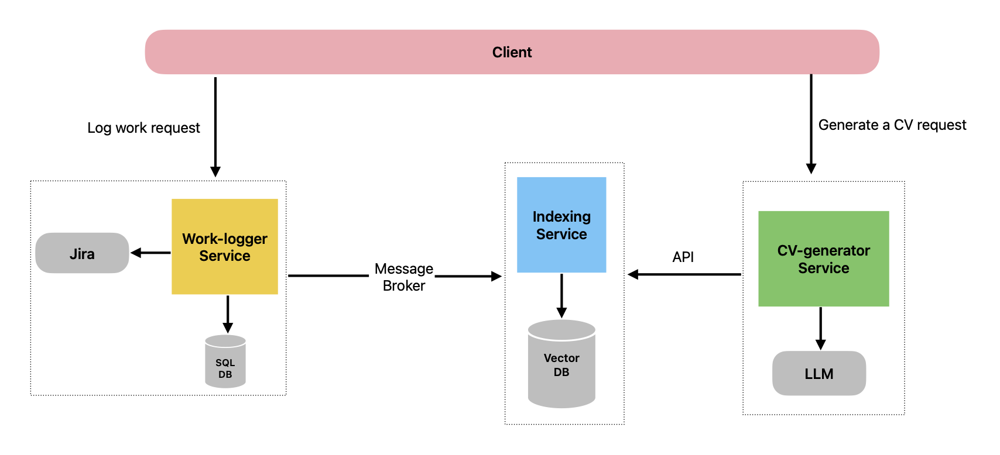

<div align="center">



</div>

# CV Generator – Modular Monolith

A Symfony 7 modular monolith that captures daily work logs, indexes them in Weaviate with semantic embeddings, and prepares the data for CV-generation workflows.  
The current focus is the **Indexing** module; Work Log ingestion runs in-process while future services (e.g. CV generation) can be extracted with minimal friction.

---

## Architecture Highlights

- **Symfony 7 Modular Monolith**  
  - `Modules/Indexing` contains Domain, Application, Infrastructure, and Presentation layers following DDD & SOLID principles.  
  - Internal services communicate via use case handlers (no external queues yet).
- **Vector Store: Weaviate**  
  Stores each work log with metadata (technologies, project, impact, etc.) and its embedding vector.
- **Embedding Provider: Ollama**  
  Generates 768‑dimensional vectors via the `nomic-embed-text` model (configurable).
- **Future CV Generation**  
  Indexed data will power retrieval-augmented generation (RAG) flows that craft tailored CVs.

---

## Prerequisites

- Docker & Docker Compose
- `make` (for convenience targets)
- (Optional) PHP ≥ 8.2 if running the Symfony console/tests outside Docker

---

## Getting Started

```bash
# 1. Start the stack (Symfony API + Weaviate + Ollama)
docker compose up -d

# 2. Pull the embedding model once (inside the Ollama container)
docker compose exec ollama ollama pull nomic-embed-text:latest

# 3. Sync the Weaviate schema
make schema-sync
```

Visit the form UI at [http://localhost:8000/work-log/new](http://localhost:8000/work-log/new) to log an entry.

---

## Makefile Shortcuts

| Command        | Description                                              |
|----------------|----------------------------------------------------------|
| `make up`      | Start services in the background                         |
| `make down`    | Stop and remove containers                               |
| `make logs`    | Tail `symfony`, `weaviate`, and `ollama` logs             |
| `make schema-sync` | Ensure the Weaviate `WorkLogEntry` class exists      |
| `make test`    | Run the Symfony test suite inside the `symfony` service  |

---

## Configuration

Key environment variables live in `backend/.env`:

```dotenv
WEAVIATE_ENDPOINT=http://weaviate:8080
WEAVIATE_CLASS=WorkLogEntry
OLLAMA_ENDPOINT=http://ollama:11434
OLLAMA_EMBED_MODEL=nomic-embed-text:latest
```

Change `OLLAMA_EMBED_MODEL` if you prefer another embedding model (remember to pull it).

---

## Usage

### 1. Web Form

- URL: `http://localhost:8000/work-log/new`  
- Fields: description, technologies, project, work type, role, collaborators, impact.  
- The controller automatically:
  - Generates a UUID entry id  
  - Timestamps the log (`loggedAt`)  
  - Requests an embedding from Ollama  
  - Upserts into Weaviate via the indexing handler  
  - Flashes success/error feedback

### 2. JSON API (existing)

POST `http://localhost:8000/index/work-log-entry`

```json
{
  "entryId": "manual-123",
  "text": "Implemented work log indexing.",
  "technologies": ["PHP", "Symfony"],
  "projectName": "CV Generator",
  "workType": "feature",
  "businessImpact": "Improved traceability for CV generation.",
  "role": "Backend Engineer",
  "collaborators": ["Alice"],
  "loggedAt": "2025-10-14T12:30:00Z",
  "embedding": [0.1, 0.2, 0.3] // optional when form is used (auto-generated)
}
```

### 3. Inspecting Indexed Data

```bash
# List objects
curl http://127.0.0.1:8080/v1/objects?class=WorkLogEntry

# GraphQL query with metadata + vector
curl http://127.0.0.1:8080/v1/graphql \
  -H 'Content-Type: application/json' \
  -d '{
        "query": "{ Get { WorkLogEntry { sourceEntryId projectName workType technologies businessImpact role collaborators loggedAt content _additional { id vector } } } }"
      }'
```

If you need to reset the schema (e.g. vector dimension mismatch):

```bash
curl -X DELETE http://127.0.0.1:8080/v1/schema/WorkLogEntry
make schema-sync
```

---

## Tests

```bash
# Host machine
cd backend && ./vendor/bin/simple-phpunit

# Or via Docker
make test
```

Tests cover:
- Domain value objects & handler behavior
- REST controller validation
- Twig form submission with fake embedding/vector store adapters

---

## Code Layout

```
backend/
 ├─ src/
 │   └─ Modules/
 │       └─ Indexing/
 │            ├─ Domain/        # Entities, value objects, repositories
 │            ├─ Application/   # Commands + handlers, embedding contracts
 │            ├─ Infrastructure/# Weaviate & Ollama adapters
 │            └─ Presentation/  # HTTP controllers + console commands
 ├─ templates/                   # Twig views
 ├─ config/                      # Service wiring + environment-specific config
 └─ tests/                       # PHPUnit suites with test doubles
```

---

## Next Steps

- Build the CV generation module that queries Weaviate and crafts CV-ready narratives.
- Introduce async processing (Messenger + queue) for embedding generation and indexing.
- Add retrieval endpoints to surface work logs for external consumers.
- Harden validation & add role-based authentication.

---

## Troubleshooting

- **Embedding vector cannot be empty**  
  Ensure the embedding model is pulled and reachable (`ollama pull ...`).
- **Vector dimension mismatch**  
  Delete and recreate the Weaviate class (see above).
- **Weaviate 404 on schema sync**  
  Run `make schema-sync` inside Docker (`docker compose exec symfony ...`).

Happy indexing!
